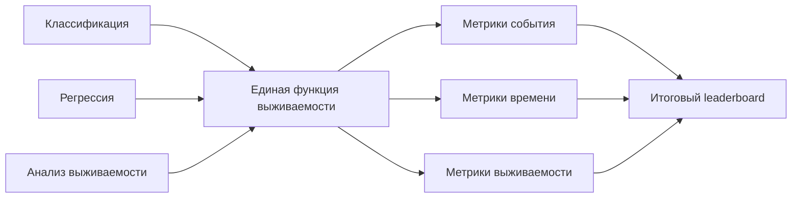

<h1 align="center">SAWrap</h1>

<p align="center">
  <strong>Исследовательский ML-сервис для сравнения классификации, регрессии и моделей анализа выживаемости в задачах прогнозирования терминальных событий.</strong>
</p>

<p align="center">
  
  
  
  
  
</p>

<p align="center">
  <a href="#коротко">Коротко</a> ·
  <a href="#научная-идея">Научная идея</a> ·
  <a href="#данные-и-eda">Данные и EDA</a> ·
  <a href="#модели-и-обертки">Модели</a> ·
  <a href="#ai-и-rag">AI и RAG</a> ·
  <a href="#быстрый-запуск">Запуск</a>
</p>

---

## Коротко

SAWrap решает проблему сравнения моделей, которые изначально отвечают на разные вопросы.
Классификация оценивает вероятность события, регрессия предсказывает время до события,
а модели анализа выживаемости строят функцию выживаемости. Проект приводит эти ответы
к единому представлению и сравнивает их в одной системе метрик.

> Центральная идея: любой прогноз в задаче терминального события приводится к функции
> выживаемости, после чего модели разных классов можно сравнивать корректно.

$$
S(t \mid X)=P(T>t \mid X)
$$

### Что уже реализовано

| Направление | Реализация |
|---|---|
| Веб-интерфейс | FastAPI + Jinja2, вкладки проекта, графики, leaderboard, AI-интерпретация |
| Эксперименты | 7 медицинских наборов данных, 20 разбиений, 5-fold CV, подбор гиперпараметров |
| Модели | Классификация, регрессия, модели анализа выживаемости, Piecewise-расширения |
| Метрики | 12 метрик для события, времени события и функции выживаемости |
| Инженерия | Docker, CI, тесты, предрассчитанные таблицы, воспроизводимый leaderboard |
| AI | OpenRouter-интерпретатор результатов и RAG-ассистент по проекту |

---

## Почему это важно

В задачах времени до события часто встречаются цензурированные наблюдения. Это
наблюдения, где событие не наступило за период исследования, поэтому точное время
его наступления неизвестно.

Обычная классификация и регрессия теряют часть этой информации:

| Тип модели | Что возвращает | Проблема на цензурированных данных |
|---|---|---|
| Классификация | Вероятность события | Может принять цензурированный объект за отсутствие события |
| Регрессия | Числовое время события | Часто требует точного времени события и теряет неполные наблюдения |
| Анализ выживаемости | Функцию выживаемости | Учитывает цензурирование напрямую |

Примеры терминальных событий:

| Сфера | Терминальное событие |
|---|---|
| Медицина | Смерть, рецидив заболевания, развитие СПИД, сердечно-сосудистое событие |
| Инженерия | Отказ оборудования |
| Финансы | Дефолт, уход клиента |
| Продукты | Отток пользователя |

---

## Научная идея

Проект сравнивает три постановки задачи через единый объект - функцию выживаемости.

| Подход | Исходный прогноз | Приведение к функции выживаемости |
|---|---|---|
| Классификация | $\widehat P(X)$ | $\widehat S(t \mid X)=1-\widehat P(X)$ |
| Регрессия | $\widehat T(X)$ | $\widehat S(t \mid X)=\mathbb{I}(t<\widehat T(X))$ |
| Анализ выживаемости | $\widehat S(t \mid X)$ | Уже находится в нужном виде |

Из общей функции выживаемости получаются три согласованных прогноза:

| Что нужно получить | Формула |
|---|---|
| Вероятность события | $\widehat P(T\le t_{\max}\mid X)=1-\widehat S(t_{\max}\mid X)$ |
| Ожидаемое время | $\widehat T(X)=\int_0^{t_{\max}}\widehat S(t\mid X)\,dt$ |
| Кривая выживаемости | $\widehat S(t\mid X)$ |



---

## Данные и EDA

В исследовании используются 7 открытых медицинских наборов данных из
`survivors.datasets`. Они отличаются размером, числом признаков, долей
цензурирования и количеством пропусков.

| Показатель | Значение |
|---|---:|
| Наборов данных | 7 |
| Наблюдений суммарно | 22 914 |
| Диапазон числа признаков | 7-35 |
| Диапазон цензурирования | 31,89-91,66% |

### Наборы данных

| Датасет | Наблюдений | Признаков | Категориальных | Целевые переменные | Цензурирование | Пропуски | Терминальное событие |
|---|---:|---:|---:|---|---:|---:|---|
| ACTG | 1151 | 11 | 7 | `time`, `event` | 91,66% | 0 | СПИД |
| GBSG | 686 | 8 | 3 | `rfst`, `cens` | 56,41% | 0 | Рецидив рака молочной железы |
| PBC | 418 | 17 | 5 | `time`, `status` | 61,48% | 1033 | Смерть |
| Rott2 | 2982 | 11 | 6 | `time`, `event` | 57,34% | 0 | Смерть |
| Smarto | 3873 | 26 | 9 | `TEVENT`, `EVENT` | 88,12% | 6357 | Сердечно-сосудистое заболевание |
| Framingham | 4699 | 7 | 2 | `followup`, `chdfate` | 68,35% | 42 | Ишемическая болезнь сердца |
| Support2 | 9105 | 35 | 11 | `d.time`, `death` | 31,89% | 34 726 | Смерть |

### Выводы EDA

| Наблюдение | Значение для проекта |
|---|---|
| ACTG и Smarto имеют очень высокую долю цензурирования | Проверяется устойчивость моделей при большом числе неполных наблюдений |
| PBC, Smarto, Framingham и Support2 содержат пропуски | Предобработка является обязательной частью пайплайна |
| Support2 самый крупный и самый широкий | Проверяется масштабируемость на 9105 наблюдениях и 35 признаках |
| GBSG и PBC небольшие | Проверяется устойчивость подхода на малых выборках |

---

## Модели и обертки

### Использованные модели

| Семейство | Модели |
|---|---|
| Классификация | `LogisticRegression`, `SVC`, `KNeighborsClassifier`, `DecisionTreeClassifier`, `RandomForestClassifier`, `GradientBoostingClassifier` |
| Регрессия | `ElasticNet`, `SVR`, `KNeighborsRegressor`, `DecisionTreeRegressor`, `RandomForestRegressor`, `GradientBoostingRegressor` |
| Анализ выживаемости | `KaplanMeierFitter`, `CoxPHSurvivalAnalysis`, `SurvivalTree`, `RandomSurvivalForest`, `GradientBoostingSurvivalAnalysis`, `CRAID`, `ParallelBootstrapCRAID` |
| Piecewise-расширение | `PiecewiseClassifWrapSA`, `PiecewiseCensorAwareClassifWrapSA` |

### Обертки, добавленные в `survivors`

| Обертка | Для каких моделей | Что делает |
|---|---|---|
| `ClassifWrapSA` | Классификаторы | Переводит вероятность события в функцию выживаемости |
| `RegrWrapSA` | Регрессоры | Переводит прогноз времени события в ступенчатую функцию выживаемости |
| `SAWrapSA` | Модели анализа выживаемости | Задает общий интерфейс для моделей, которые уже возвращают функцию выживаемости или риск |

Эти обертки позволяют сравнивать разные классы моделей по одним и тем же метрикам:
вероятности события, времени до события и функции выживаемости.

---

## Piecewise-times

Обычный классификационный адаптер строит постоянную по времени оценку функции
выживаемости. Piecewise-times делит временной горизонт на равномерные интервалы
и обучает отдельный классификационный риск для каждого интервала.

$$
\widehat S(t_k \mid X)=\prod_{j=1}^{k}\left(1-\widehat p_j(X)\right)
$$

Реализованы два варианта:

| Обертка | Идея |
|---|---|
| `PiecewiseClassifWrapSA` | Базовая интервальная схема для классификаторов |
| `PiecewiseCensorAwareClassifWrapSA` | Интервальная схема, дополнительно учитывающая цензурирование |

Для каждой пары "Piecewise-обертка + базовый классификатор" система сначала
выбирает один лучший `times` по всем датасетам, а затем использует только эту
вариацию в графиках, AI-интерпретаторе и итоговом leaderboard.

### Эффект для `DecisionTreeClassifier`

| Piecewise-модель | Выбранный `times` | Изменение метрик | Место в итоговой таблице |
|---|---:|---|---:|
| `PiecewiseClassifWrapSA(DecisionTreeClassifier)` | 8 | `AUC_EVENT` выше в 5 из 7 датасетов, `LOGLOSS_EVENT` ниже во всех 7 датасетах, `RMSE_EVENT` ниже в 4 из 7 датасетов | 23 |
| `PiecewiseCensorAwareClassifWrapSA(DecisionTreeClassifier)` | 16 | `AUC_EVENT` выше в 4 из 7 датасетов, `LOGLOSS_EVENT` ниже во всех 7 датасетах, `RMSE_EVENT` ниже в 3 из 7 датасетов | 16 |

Лучший Piecewise-метод в общем leaderboard:

| Место | Метод | Датасетов | Средняя позиция |
|---:|---|---:|---:|
| 3 | `PiecewiseCensorAwareClassifWrapSA(LogisticRegression, times=16)` | 7 | 9.00 |

---

## Метрики

В проекте используются 12 метрик. RAG и AI-интерпретатор дополнительно защищены
от подстановки неиспользуемых метрик.

### Метрики события

| Метрика | Направление | Формула или смысл |
|---|---|---|
| `AUC_EVENT` | Выше лучше | $\mathrm{AUC}=\frac{1}{n_1n_0}\sum_{i:Y_i=1}\sum_{j:Y_j=0}\mathbb{I}(\widehat P_i>\widehat P_j)$ |
| `LOGLOSS_EVENT` | Ниже лучше | $-\frac{1}{n}\sum_i\left[Y_i\ln \widehat P_i+(1-Y_i)\ln(1-\widehat P_i)\right]$ |
| `RMSE_EVENT` | Ниже лучше | $\sqrt{\frac{1}{n}\sum_i(Y_i-\widehat P_i)^2}$ |

### Метрики времени

| Метрика | Направление | Формула или смысл |
|---|---|---|
| `RMSE_TIME` | Ниже лучше | $\sqrt{\frac{1}{n}\sum_i(\widetilde T_i-\widehat T_i)^2}$ |
| `R2_TIME` | Выше лучше | $1-\frac{\sum_i(\widetilde T_i-\widehat T_i)^2}{\sum_i(\widetilde T_i-\overline T)^2}$ |
| `MAPE_TIME` | Ниже лучше | Средняя абсолютная процентная ошибка |
| `MEDAPE_TIME` | Ниже лучше | Медианная абсолютная процентная ошибка |
| `SPEARMAN_TIME` | Выше лучше | Ранговая корреляция Спирмена |
| `RMSLE_TIME` | Ниже лучше | Ошибка по логарифмированному времени |

### Метрики функции выживаемости

| Метрика | Направление | Формула или смысл |
|---|---|---|
| `CI` | Выше лучше | Доля согласованных сравнимых пар |
| `IBS` | Ниже лучше | $\mathrm{IBS}=\frac{1}{t_{\max}}\int_0^{t_{\max}}BS(t)\,dt$ |
| `AUPRC` | Выше лучше | Площадь под precision-recall кривой для функции выживаемости |

Не используются как метрики проекта: `Accuracy`, `F1`, `Precision`, `Recall`,
`MAE`, `MSE`, `MSLE`, `Explained variance`, отдельный `Logarithmic score`.

---

## Экспериментальный сценарий

| Шаг | Что происходит |
|---:|---|
| 1 | Загружается один из 7 наборов данных из `survivors.datasets` |
| 2 | Данные приводятся к формату времени до события: признаки, наблюдаемое время и индикатор события |
| 3 | Для классификации, регрессии и анализа выживаемости задаются модели и сетки гиперпараметров |
| 4 | Лучшие гиперпараметры выбираются через 5-кратную кросс-валидацию |
| 5 | Лучшие модели обучаются и проверяются на 20 различных разбиениях данных |
| 6 | Прогнозы приводятся к функции выживаемости через `ClassifWrapSA`, `RegrWrapSA` и `SAWrapSA` |
| 7 | Для Piecewise-моделей выбирается один глобальный `times` для каждой пары обертка + базовая модель |
| 8 | Считаются метрики события, времени и функции выживаемости |
| 9 | Результаты сохраняются в `UI/tables/*.xlsx` |
| 10 | `rank.py` строит общий leaderboard в `UI/tables/leaderboards_by_task.xlsx` |

---

## Итоговые результаты

Источник: `UI/tables/leaderboards_by_task.xlsx`, лист `OVERALL_ALL`.

| Место | Метод | Датасетов | Средняя позиция |
|---:|---|---:|---:|
| 1 | `ParallelBootstrapCRAID` | 7 | 4.67 |
| 2 | `CRAID` | 7 | 8.00 |
| 3 | `PiecewiseCensorAwareClassifWrapSA(LogisticRegression, times=16)` | 7 | 9.00 |
| 4 | `GradientBoostingSurvivalAnalysis` | 7 | 9.67 |
| 5 | `PiecewiseCensorAwareClassifWrapSA(RandomForestClassifier, times=16)` | 7 | 9.67 |

Интерпретация результатов:

| Вывод | Почему это важно |
|---|---|
| Модели анализа выживаемости устойчиво сильны на цензурированных данных | Они используют информацию о неполных наблюдениях напрямую |
| Piecewise-times попадает в top-3 | Классификационная ветка становится конкурентной после добавления временной структуры |
| Единое представление делает сравнение корректным | Классификация, регрессия и анализ выживаемости оцениваются в одной системе |

---

## AI и RAG

### AI-интерпретатор результатов

AI-интерпретатор читает реальные метрики из `UI/tables`, выбирает модель под
датасет и задачу, учитывает Piecewise-варианты и объясняет, почему выбранная
модель подходит.

| Компонент | Назначение |
|---|---|
| `UI/helpers_ai_advice.py` | Подготовка метрик, рекомендаций и контекста для LLM |
| OpenRouter | Внешняя LLM для текстовой интерпретации |
| `OPENROUTER_API_KEY` | Секретный ключ, который хранится вне git |
| `OPENROUTER_MODEL` | Модель, например `openai/gpt-4o-mini` |

### RAG-ассистент

RAG отвечает на вопросы по проекту, диплому, коду, таблицам и knowledge-базе.
Для semantic retrieval используется `intfloat/multilingual-e5-small`.

| Источник | Что дает ассистенту |
|---|---|
| `knowledge/*.md` | Короткая структурированная база знаний |
| `README.md` | Общее описание проекта и сценариев |
| Python-файлы | Реальная логика приложения |
| `UI/tables/*.xlsx` | Метрики, leaderboard и предрассчитанные результаты |
| Диплом из `SAWRAP_THESIS_DIR` | Научный контекст, постановка задачи, формулы |

Сборка semantic index:

```bash
SAWRAP_THESIS_DIR="/path/to/ДипломML_SA-3" \
python3 scripts/build_rag_index.py --retriever embeddings
```

Индекс сохраняется в `UI/rag_index` и не должен попадать в git.

---

## Сценарии использования

| Сценарий | Как используется |
|---|---|
| Локальный запуск экспериментов на пользовательских данных | Серверная конфигурация рассчитана на быстрый показ предрассчитанных результатов, но расчетный модуль готов для локального запуска экспериментов |
| Выбор лучшей модели по рейтингу | Во вкладке `Результаты` и на странице `/leaderboard` отображается агрегированный leaderboard |
| Использование оберток как библиотеки | `ClassifWrapSA`, `RegrWrapSA` и `SAWrapSA` применяются отдельно от сайта в собственном пайплайне |
| Экспериментальный сценарий `survivors` | Запускается подбор гиперпараметров, кросс-валидация и серия разбиений |
| Piecewise-обертки для классификации | Классификатор получает временную структуру и становится сопоставимым с моделями анализа выживаемости |

Пример локального пересчета:

```bash
python3 run_many_server.py --dataset support2 --processes 1
python3 rank.py
```

Пример использования обертки:

```python
from sklearn.ensemble import RandomForestClassifier
from survivors.external import ClassifWrapSA

model = ClassifWrapSA(RandomForestClassifier(random_state=42))
model.fit(X_train, y_train, time_col="time", event_col="event")

survival_curve, times = model.predict_survival_function(X_test)
event_proba = model.predict_proba(X_test)[:, 1]
expected_time = model.predict_expected_time(X_test)
```

---

## Архитектура

```text
SAWrap/
  UI/
    app.py                    FastAPI routes
    helpers_tables.py          чтение таблиц и Piecewise-выбор
    helpers_ai_advice.py       AI-интерпретатор результатов
    helpers_project_rag.py     RAG-ассистент
    helpers_piecewise.py       сводка Piecewise-times
    templates/                 Jinja2-страницы
    static/css/styles.css      интерфейс
    tables/                    предрассчитанные результаты
    images/                    графики leaderboard
  knowledge/                   база знаний для RAG
  scripts/build_rag_index.py   сборка semantic/TF-IDF индекса
  rank.py                      пересчет leaderboard
  run_many_server.py           экспериментальный запуск
  tests/                       unit-тесты
  Dockerfile
  .github/workflows/ci.yml
```

---

## Быстрый запуск

Рекомендуется запускать из директории уровнем выше репозитория.

```bash
cd /Users/dimonzhi/Documents/proga
SAWRAP_SKIP_MISSING_RECALC=1 \
python3 -m uvicorn SAWrap.UI.app:app --host 0.0.0.0 --port 8000 --reload
```

Открыть сайт:

```text
http://127.0.0.1:8000
```

`SAWRAP_SKIP_MISSING_RECALC=1` включает быстрый режим: сайт читает
предрассчитанные таблицы и не переобучает модели при открытии графиков.

---

## Docker и деплой

### Docker

```bash
docker build -t sawrap:local .
docker run --rm -p 8000:8000 \
  -e SAWRAP_SKIP_MISSING_RECALC=1 \
  sawrap:local
```

Запуск с OpenRouter:

```bash
docker run --rm -p 8000:8000 \
  -e SAWRAP_SKIP_MISSING_RECALC=1 \
  -e OPENROUTER_API_KEY="твой_ключ" \
  -e OPENROUTER_MODEL="openai/gpt-4o-mini" \
  sawrap:local
```

### Переменные окружения

`.env.example` содержит пример, а реальный `.env` игнорируется git.

```bash
export OPENROUTER_API_KEY="твой_ключ"
export OPENROUTER_MODEL="openai/gpt-4o-mini"
export SAWRAP_SKIP_MISSING_RECALC=1
```

### Серверный сценарий

В `deploy/` лежат примеры для Docker, systemd и nginx:

| Файл | Назначение |
|---|---|
| `deploy/docker-run.example.sh` | Пример запуска контейнера |
| `deploy/sawrap.service.example` | Пример systemd unit |
| `deploy/nginx-sawrap-subdomain.conf.example` | Публикация через поддомен |
| `deploy/nginx-sawrap-location.conf.example` | Публикация под путем |

---

## Проверки качества

Установка тестовых зависимостей:

```bash
python3 -m pip install -r requirements-test.txt
```

Запуск тестов:

```bash
python3 -m pytest -q
```

Проверка компиляции:

```bash
python3 -m compileall UI tests scripts rank.py
```

Что покрывают тесты:

| Блок | Проверяется |
|---|---|
| Leaderboard | Ранжирование, чтение таблиц, итоговая агрегация |
| Piecewise | Выбор глобального `times` и согласованность результатов |
| AI | Интерпретатор, OpenRouter transport через fake opener |
| RAG | Retrieval, prompt guardrails, запрет выдуманных метрик |
| Сборка | `compileall` и Docker build в CI |

CI workflow находится в `.github/workflows/ci.yml` и запускается на `push` и
`pull_request`.

---

## Страницы сайта

| URL | Что находится на странице |
|---|---|
| `/` | Выбор датасета, модели, график метрик, AI-интерпретатор, RAG |
| `/overview` | Цель проекта, методология, модели, EDA, эксперимент, результаты, сценарии |
| `/leaderboard` | Общий leaderboard и изображения сравнения |

Готовые изображения leaderboard лежат в `UI/images`:

| Файл | Сравнение |
|---|---|
| `UI/images/Classif_vs_SA_rus.png` | Классификация против анализа выживаемости |
| `UI/images/Regr_vs_SA_rus.png` | Регрессия против анализа выживаемости |
| `UI/images/Classif_vs_Regr_rus.png` | Классификация против регрессии |

---

## Сильные стороны проекта

| Критерий | Что показывает проект |
|---|---|
| Разработка и инженерия | Git, Docker, CI, тесты, модульная структура, воспроизводимый leaderboard |
| Data Science | EDA, предобработка, 7 датасетов, 12 метрик, валидация, подбор гиперпараметров |
| Применение AI | AI-интерпретатор, OpenRouter, RAG, semantic embeddings, guardrails |
| Продуктовое мышление | Понятная проблема, целевая аудитория, MVP, сценарии использования, roadmap |

---

## Roadmap

| Направление | Следующий шаг |
|---|---|
| Пользовательские данные | Загрузка датасета через UI и автоматическая проверка схемы |
| Auto-report | Генерация отчета по выбранному датасету, моделям и метрикам |
| Piecewise | Дополнительные стратегии построения временной сетки |
| MLOps | История запусков, мониторинг качества и версионирование экспериментов |
| RAG quality | Набор контрольных вопросов для оценки полноты ответов |
